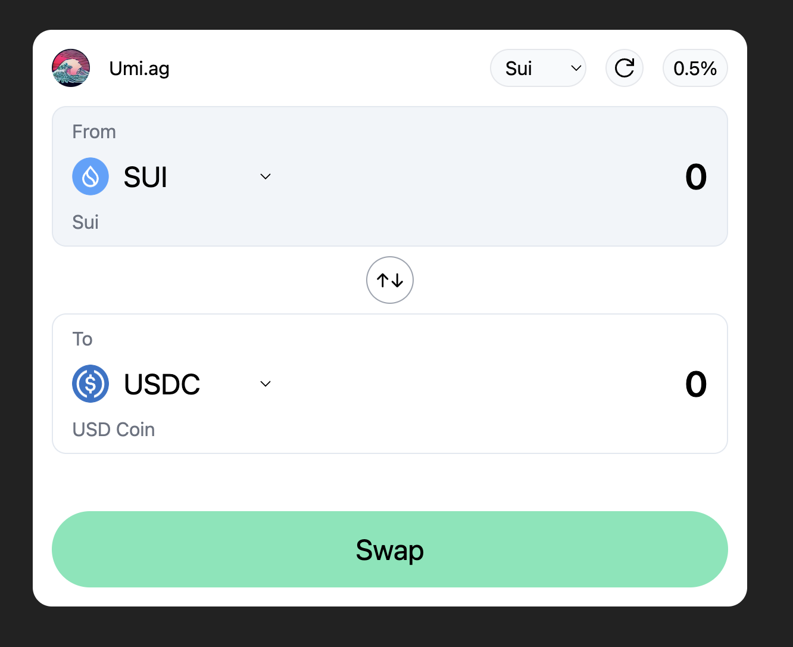

# @umi-ag/swap-widget

<p align="center">
  
</p>

<p align="center" style="font-size: 150%">
   <a href="https://swap-widget.umi.ag">DEMO</a>
</p>

## Overview

@umi-ag/swap-widget is a powerful library designed for React projects. It
encapsulates components for a Swap interface, hooks for interacting with quote
API and sui-coin-list API. This library simplifies the process of introducing
cryptocurrency swapping functionalities into your React applications, enabling a
quick and easy trading experience for your users. The primary aim is to
facilitate a seamless integration of Umi Aggregator's functionality into users'
websites. A live demonstration of the Swap widget can be viewed at
[https://swap-widget.umi.ag](https://swap-widget.umi.ag).

## Features

1. Swap Interface: Provides a ready-made Swap component, allowing you to
   introduce cryptocurrency swapping capabilities in your React applications
   instantly.
2. Quote API Hooks: Contains hooks that allow your application to interact with
   the quote API, facilitating the discovery of efficient trading routes, akin
   to what's offered by 1inch.
3. Sui-coin-list API Hooks: Includes hooks to interact with the sui-coin-list
   API, simplifying the process of fetching coin data from Sui.

## Installation

To install the @umi-ag/swap-widget library, run the following command in your
project's root directory:

```bash
npm install @umi-ag/swap-widget
# or yarn
yarn add @umi-ag/swap-widget
# or pnpm
pnpm add @umi-ag/swap-widget
```

## Usage

### Swap Interface

```tsx
import { UmiSwapWidget } from "./components/Swap";
import { JsonRpcProvider, mainnetConnection } from "@mysten/sui.js";

function App() {
  const { currentAccount, currentWallet } = useWalletKit();
  const provider = new JsonRpcProvider(mainnetConnection);

  /**
   * You need to pass these props to the UmiSwapWidget component:
   *
   * type SwapWidgetProps = {
   *    accountAddress?: string;
   *    wallet?: {
   *       signAndExecuteTransactionBlock: (p: any) => Promise<any>;
   *    } | null;
   *    provider?: JsonRpcProvider;
   *    partnerPolicyObjectId?: string;
   * };
   */

  return (
    <>
      <UmiSwapWidget
        accountAddress={currentAccount?.address}
        wallet={currentWallet}
        provider={provider}
        partnerPolicyObjectId="0x1234....abcde"
      />
    </>
  );
}

export default App;
```

### Hooks

Or you can use the hooks directly:

```ts
import { useBalance, useCoinList, useQuoteApi } from "@umi-ag/swap-widget";

const balances = useBalance({
  chain, // default to Sui
  provider: props.provider, // JsonRpcProvider
  accountAddress: props.accountAddress, // string
});

const coinList = useCoinList({
  chain,
});

const quote = useQuoteApi({
  chain,
  quoteQuery,
});
```

These hooks use swr internally, so you can access the data and error like this:

```tsx
const { data: balances, error: balanceError } = useBalance({
  chain,
  provider: props.provider,
  accountAddress: props.accountAddress,
});
```

For the detail of QuoteQuery, please refer to
[Umi SDK](https://github.com/umi-ag/umi-sdk/blob/alpha/typescript/sui-sdk/src/types/index.ts#L67)

These hooks will handle fetching data from the quote and sui-coin-list APIs,
respectively, and will return the data and any error that occurs during the
fetch.

Please refer to our comprehensive documentation for a more in-depth guide on how
to use the @umi-ag/swap-widget library.

## Contributing

We warmly welcome contributions to the @umi-ag/swap-widget! Please ensure that
your code adheres to our style guidelines, and all tests pass before submitting
a Pull Request. Thank you for your contribution to @umi-ag/swap-widget!
